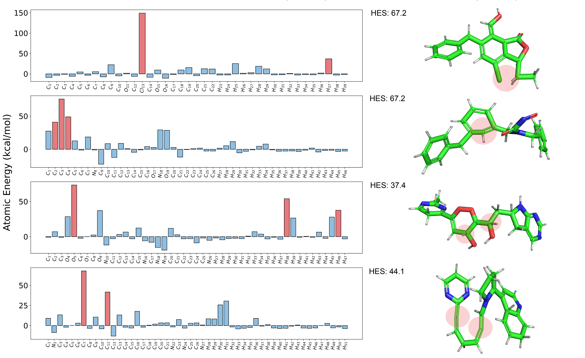

# High-Energy Atom Detection (HEAD)

**Paper preprint on [bioRxiv](https://www.biorxiv.org/content/10.1101/2024.11.10.622844v1)**

HEAD utilizes an AI-derived force field ([ANI-2x](http://doi.org/10.1021/acs.jctc.0c00121) in this work) to identify atoms with elevated energy levels caused by implausible neighboring environments.

## Create Environment

```bash
cd HEAD
# create conda env from yml file
conda env create -f head_env.yml

# activate the environment
conda activate head_env
```

## Running the Validity Test
After installation, you can run the evaluation pipeline on your own dataset of generated molecules or replicate the experiments conducted in this study.

We provide the following code snippet for the detailed usage of HEAD. Or you can directly run it by command lines.

---

### Method 1 (Code snippet)

Prepare an input file that contains one or multiple molecule conformations. **Note** that, HEAD requires conformations with Hydrogen atoms, if the input file does not contain Hydrogens, please set the `add_Hs` to `True`.

```python
from head import HEAD

# Input a csv that stores sdf strings with a column name, e.g., "conformer_sdf"
head = HEAD(
    file_path="examples/example.csv",
    csv_column="conformer_sdf",  # the field that stores sdf string of input molecules
)
```

Or provide an `.sdf` file,

```python
# Or input an sdf file that stores one of many molecule conformations
head = HEAD(
    file_path="examples/example.sdf",
)
```

Start evalutation for detecting physically implausible conformations, and save the HEAD report to csv file.
```python
# Run the HEAD
head.run(use_info_entropy=True)

# Save the detected results into csv file
head.write_report(output_csv="./head_report.csv")
```

*(Optional)* Plot the atomic-level evaluation result for the conformation,

```python
# Plot the 0-th conformation evaluation result
head.plot(index=0)
```
Then, you should get something like this, which shows the atomic-level details of HEAD result. The red circled part of each conformation corresponds to the red bars in each bar plot.


---

### Method 2 (Command line)

Run the following command,
```bash
python head.py --file_path examples/example.sdf --write_report --plot
```
Then, you should find the output report (HEAD_report.csv) and plot (HEAD_fig_0.png) stored under this directory.

## Speed

When running HEAD for a large amount of molecule conformations, HEAD takes ***around 50 conformations per second*** on one single GPU (e.g., NVIDIA GeForce RTX 3090).

## About the HEAD report
HEAD report stores molecule-level and atomic-level details for the evaluation. Please refer the following for the understanding of the report.
- **invalidity**: whether this conformation is valid or not. 
    - 0: valid conformation
    - 1: invalid conformation
    - -1: unsupported conformation that may contain elements out of {H, C, N, O, F, S, Cl} OR unexpected error during loading

- **invalid atoms**: contains all atomic-level invalid details if the current conformation is detected as invalid, else None. for example,
    - [(2, 'C', 40.962)]: indicates the No.2 (the index starts from 1) Carbon atom is detected as invalid due to the high-energy response 40.962 kcal/mol (Note that, this energy is only a reference, that may not be precise)

- **HES**: High-Energy Score decribes the invalidity of this conformation. It is zero if the conformation is valid, else non-negative vlaue. The greater the HES is, the more problematic the conformation is.

- **atom types**: stores the atom types for an input conformation.

- **information entropy**: the computed information entropy for the maximum subregion, this approach is ONLY a supplementrary for HEAD (see our paper for details).

- **information entropy invalidity**: if 1, invalid conformation ONLY detected by information entropy approach, else 0.


