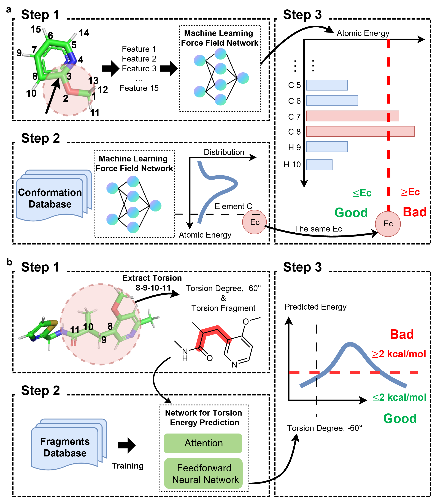

# Assessing Conformation Validity and Rationality of Deep Learning-Generated 3D Molcules

**See our paper for details [*Nature Communication*](https://www.nature.com/articles/s41467-026-69303-5)**

Recent advancements in artificial intelligence (AI) have opened new frontiers in 3D molecule generation, with applications in drug design, materials science, and more. However, evaluating the quality of generated 3D conformations remains challenging due to limitations in current methods. This project presents an open-source solution to address these limitations by combining speed with quantum mechanical (QM)-level accuracy.

## Overview

Most current evaluation methods for AI-generated 3D molecules rely either on empirical geometric metrics, which may overlook subtle conformational issues, or on molecular mechanics (MM) energy calculations, which often lack accuracy and atomic/torsional detail. This project introduces a two-stage approach to improve upon existing evaluation techniques:

1. **Validity Test**: <u>H</u>igh-<u>E</u>nergy <u>A</u>tom <u>D</u>etection (**HEAD**) utilizes an AI-derived force field to identify atoms with elevated energy levels caused by implausible neighboring environments, including both the intra-molecular clashes and the unfavorable interaction between ligand and protein.
2. **Rationality Test**: <u>T</u>orsional <u>E</u>nergy <u>D</u>escriptor (**TED**) applies a deep learning model trained with density functional theory (DFT)-level accuracy data to detect torsional energies, specifically around rotatable bonds.



Our method has been tested on five prominent AI-driven 3D molecule generation models, namely [Lingo3DMolv2](https://www.nature.com/articles/s42256-023-00775-6), [Pocket2Mol](https://arxiv.org/abs/2205.07249), [PocketFlow](https://www.nature.com/articles/s42256-024-00808-8), [TargetDiff](https://arxiv.org/abs/2303.03543) and [PMDM](https://www.nature.com/articles/s41467-024-46569-1) across 102 targets in the Directory of Useful Decoys-Enhanced (DUD-E) dataset. 


## Installation
To use this package, clone the repository and install the dependencies:
```bash
git clone https://github.com/stonewiseAIDrugDesign/HEAD_TED.git .
```
### Recommended Setup: Using Docker
To ensure the environment is set up correctly and to avoid dependency conflicts, we highly recommend using the provided `DockerFile`.
#### Instructions
1. Ensure you have Docker installed on your system.
2. Navigate to the root directory of this repository and run the following command to build an image.
```bash
docker build -f DockerFile -t head_ted ./
```
3. Run the container.
```bash
docker run -it --name head_ted -v <the-absolute-path-to-this-repository>:/home/jovyan --gpus all head_ted /bin/bash
```
This will drop you into a shell inside the pre-configured environment. And this repository will be presented under `/home/jovyan` in this container. Then enjoy yourself. 🍺

### Alternative Setup (Manual)
If you cannot use Docker, here are the manual steps. We recommend using `Python 3.10.x` for guaranteed compatibility.
```bash
pip install -r requirements.txt
```
Then navigate to the root directory of this repository and install `openbabel`.
```bash
bash postInstall
```


## Usage
### 1. Instructions for Running HEAD
See the subfolder `code/HEAD` for usage details. The default HEAD implementation employs the ANI-2x potential. Support for the MACE-OFF potential is also available; consult the readme file located in the `code/HEAD` for instructions on switching to MACE-OFF.

### 2. Instructions for Running TED
See the subfolder `code/TED` for usage details.

### 3. Instructions for Running molecule screening pipeline
See the subfolder `code/ScreeningPipeline` for usage details.

### 4. Quick Test
To initiate a reproducible execution of HEAD test and TED test, please first download the **Augmented-model** mentioned in `code/TED/README.md` and place the model files into `data/trained_model_augmentation`, then run `run_test.sh` under the root directory of this repository. This will execute the workflow of the above three functions on example data for HEAD test, including both parts for evaluating ligand conformation and ligand-protein interaction, then TED test and finally a representative demo of screening pipeline. The process is estimated to take approximately **10 minutes** to complete. Upon completion, the logs and output files will be accessible in the `results` folder under root directory.

## Example Datasets
To facilitate testing, example datasets have already been included in this repository.

## Applications and Validation
This evaluation framework has been applied to five recent AI-driven models for 3D molecule generation and evaluated on 102 targets in the DUD-E dataset. The approach can be adapted to other datasets or AI models for molecule generation.

## Reproduction Instructions
To fully reproduce all the results presented in the manuscript, interested users are encouraged to deploy the provided code locally and execute it using the complete dataset of molecules provided. These molecuels are generated on 102 DUD-E targets by five recent AI molecule generative models. These datasets can be found in the data repository at https://figshare.com/articles/dataset/Data_for_HEAD_TED/27826488. 


## Citation
If you find our code useful, please cite:

```
@article {Fan2024.11.10.622844,
	title = {Assessing Conformation Validity and Rationality of Deep Learning-Generated 3D Molecules},
	author = {Fan, Fan and Xi, Bin and Meng, Xianghu and Wang, Han and Zhang, Bowen and Xu, Qingbo and Feng, Wei and Wang, Xiaoman and Zhang, Hongbo and Zhou, Feng and Liu, Zhenming and Zhou, Wenbiao and Huang, Bo},
	year = {2024},
	doi = {10.1101/2024.11.10.622844},
	URL = {https://www.biorxiv.org/content/early/2024/11/11/2024.11.10.622844},
	eprint = {https://www.biorxiv.org/content/early/2024/11/11/2024.11.10.622844.full.pdf},
	journal = {bioRxiv}
}
```

## License
This project is licensed under the MIT License.
