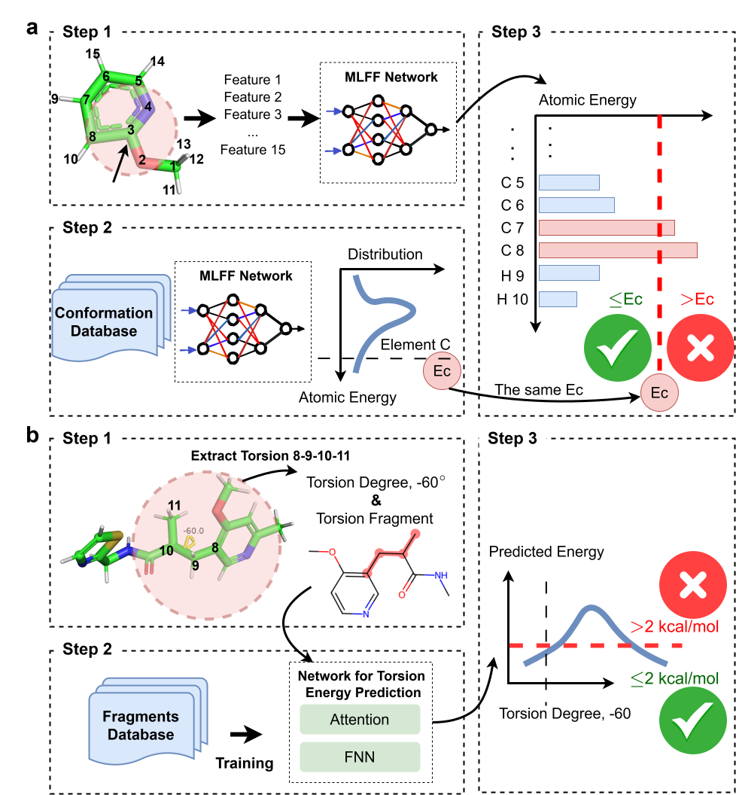

# Assessing Conformation Validity and Rationality of Deep Learning-Generated 3D Molcules

**Paper preprint on [bioRxiv](https://www.biorxiv.org/content/10.1101/2024.11.10.622844v1)**

Recent advancements in artificial intelligence (AI) have opened new frontiers in 3D molecule generation, with applications in drug design, materials science, and more. However, evaluating the quality of generated 3D conformations remains challenging due to limitations in current methods. This project presents an open-source solution to address these limitations by combining speed with quantum mechanical (QM)-level accuracy.

## Overview

Most current evaluation methods for AI-generated 3D molecules rely either on empirical geometric metrics, which may overlook subtle conformational issues, or on molecular mechanics (MM) energy calculations, which often lack accuracy and atomic/torsional detail. This project introduces a two-stage approach to improve upon existing evaluation techniques:

1. **Validity Test**: <u>H</u>igh-<u>E</u>nergy <u>A</u>tom <u>D</u>etection ([HEAD](https://github.com/stonewiseAIDrugDesign/HEAD_TED/blob/main/HEAD/README.md)) utilizes an AI-derived force field to identify atoms with elevated energy levels caused by implausible neighboring environments.
2. **Rationality Test**: <u>T</u>orsional <u>E</u>nergy <u>D</u>escriptor ([TED](https://github.com/stonewiseAIDrugDesign/HEAD_TED/blob/main/TED/README.md)) applies a deep learning model trained with density functional theory (DFT)-level accuracy to detect torsional energies, specifically around rotatable bonds.



Our method has been tested on five prominent AI-driven 3D molecule generation models, namely [Lingo3DMolv2](https://www.nature.com/articles/s42256-023-00775-6), [Pocket2Mol](https://arxiv.org/abs/2205.07249), [PocketFlow](https://www.nature.com/articles/s42256-024-00808-8), [TargetDiff](https://arxiv.org/abs/2303.03543) and [PMDM](https://www.nature.com/articles/s41467-024-46569-1) across 102 targets in the Directory of Useful Decoys-Enhanced (DUD-E) dataset. 


## Installation & Usage

To use this package, clone the repository and install the dependencies:

```bash
git clone https://github.com/stonewiseAIDrugDesign/HEAD_TED.git

```

### 1. Dependencies for Running HEAD

See [HEAD](https://github.com/stonewiseAIDrugDesign/HEAD_TED/blob/main/hea-detect/README.md) for installation details.

### 2. Dependencies for Running TED

See [TED](https://github.com/stonewiseAIDrugDesign/HEAD_TED/blob/main/TED/README.md) for installation details.


## Example Datasets
To facilitate testing, example datasets are provided. You can also download the released GM5K, GM1K or generated molecules by each model via the link: to be uploaded.

## Applications and Validation
This evaluation framework has been applied to five recent AI-driven models for 3D molecule generation and evaluated on 102 targets in the DUD-E dataset. The approach can be adapted to other datasets or AI models for molecule generation.

## Citation
If you find our code useful, please cite:

```
@article {Fan2024.11.10.622844,
	title = {Assessing Conformation Validity and Rationality of Deep Learning-Generated 3D Molecules},
	author = {Fan, Fan and Xi, Bin and Meng, Xianghu and Wang, Han and Zhang, Bowen and Xu, Qingbo and Feng, Wei and Wang, Xiaoman and Zhang, Hongbo and Zhou, Feng and Liu, Zhenming and Zhou, Wenbiao and Huang, Bo},
	year = {2024},
	doi = {10.1101/2024.11.10.622844},
	URL = {https://www.biorxiv.org/content/early/2024/11/11/2024.11.10.622844},
	eprint = {https://www.biorxiv.org/content/early/2024/11/11/2024.11.10.622844.full.pdf},
	journal = {bioRxiv}
}
```

## License
This project is licensed under the MIT License.


